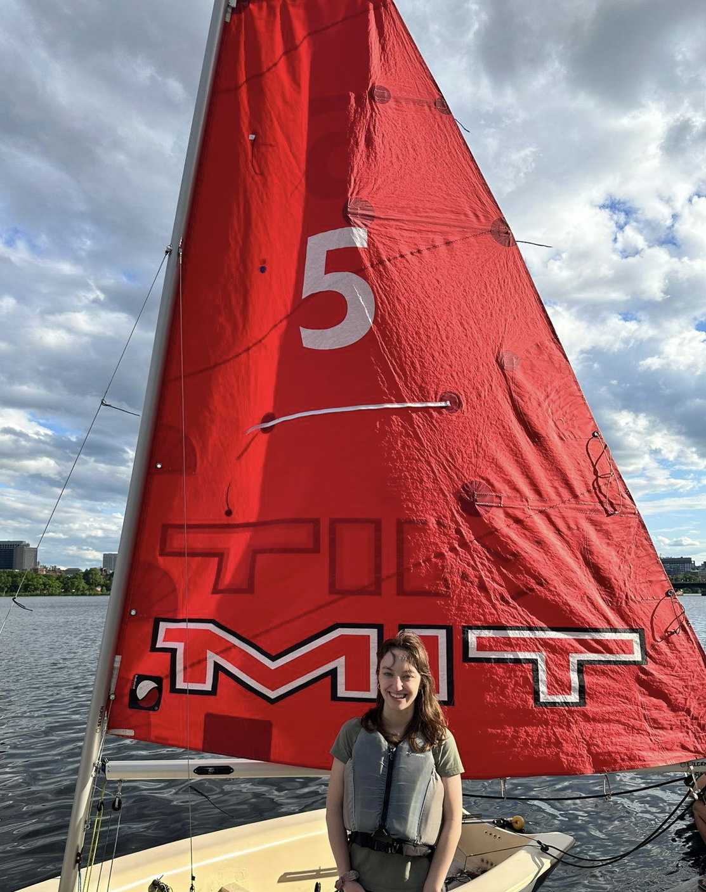

  

I am a first-year EECS PhD student at MIT. I am fortunate to be advised by Dr. Polina Golland. In my undergrad, I was fortunate to be advised by Dr. Christine Hendon at Columbia Engineering. My current research is in develop computer vision methods for fetal imaging.

For anyone interested in applying to graduate school, here is my [advice](./grad_advice.md).

